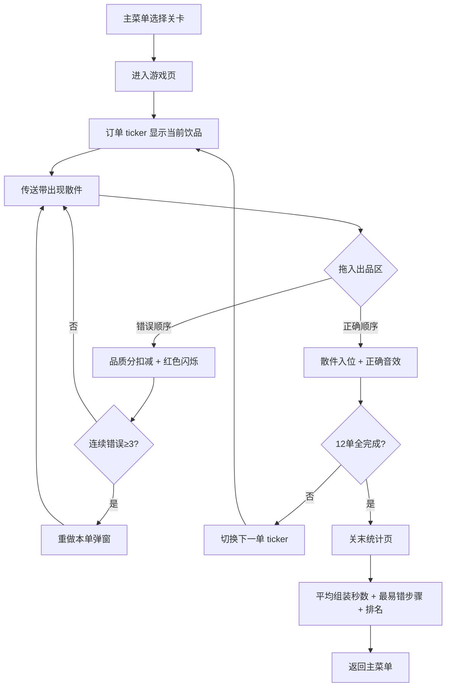

## 1. 产品概述

饮品出杯教学小游戏——面向新入职茶饮/咖啡店员的横版 2D 拖拽排序训练工具，通过模拟真实出杯流水线帮助学员快速记忆不同品牌的饮品组装顺序，解决培训师无法每店蹲点、纸质 SOP 枯燥难记的痛点。

- 目标用户：星巴克、喜茶、蜜雪冰城等连锁品牌新入职兼职/全职店员
- 核心价值：将 SOP 记忆转化为游戏化肌肉记忆，3 关覆盖 3 大品类产线，关末排名激发竞争学习动力

## 2. 核心功能

### 2.1 用户角色

| 角色 | 说明 |
|------|------|
| 学员 | 游玩三关、查看关末统计与排名 |
| 培训师（可选） | 配置关卡数据 JSON、查看学员成绩 |

### 2.2 功能模块

1. **主菜单页**：品牌选择、开始游戏、音量控制
2. **游戏页**：订单 ticker + 传送带 + 出品区 + 计时器 + 品质分
3. **关末统计页**：平均组装秒数、最易错步骤排行、六品牌模拟排名

### 2.3 页面详情

| 页面 | 模块 | 功能描述 |
|------|------|----------|
| 主菜单页 | 品牌选择 | 三关卡片：星巴克经典咖啡线 / 喜茶水果茶线 / 蜜雪冰城平价线 |
| 主菜单页 | 音量控制 | 静音/开启 BGM 切换按钮 |
| 游戏页 | 订单 ticker | 屏幕上方水平滚动显示当前订单（如"冰美式 少冰"），已完单灰化，当前单高亮 |
| 游戏页 | 传送带 | 下方传送带从右向左移动散件（杯、冰、茶底、小料、奶盖…），含干扰项 |
| 游戏页 | 出品区 | 中部放置区，玩家拖入散件按正确顺序叠放，实时反馈对错 |
| 游戏页 | 计时器 | 右上角倒计时，<25秒时变红闪烁 |
| 游戏页 | 品质分 | 当前单品质分 100 起步，错序扣分 |
| 游戏页 | 连续错误提示 | 连续三次错误触发"重做本单"弹窗，不扣分但计时继续 |
| 关末统计页 | 平均组装秒数 | 12 单总用时 / 12 |
| 关末统计页 | 最易错步骤排行 | Top 3 最常出错的步骤名称及错误次数 |
| 关末统计页 | 六品牌模拟排名 | 品牌训练榜排名柱状图（模拟数据） |

## 3. 核心流程

玩家从主菜单选择关卡 → 进入游戏页 → 屏幕上方订单 ticker 滚动显示当前饮品 → 下方传送带出现散件（含干扰项）→ 玩家按正确顺序将散件拖入出品区 → 正确则散件入位并播放正确音效 → 错误则品质分扣减并闪烁红色 → 连续三次错误触发重做本单（不扣分但耗时长）→ 完成当前单后 ticker 切换下一单 → 12 单全部完成或时间耗尽 → 进入关末统计页 → 展示平均组装秒数、最易错步骤排行、六品牌模拟排名 → 返回主菜单

## 4. 用户界面设计

### 4.1 设计风格

- **主色调**：暖咖啡色系（#6F4E37）搭配品牌主题色（星巴克绿 #00704A / 喜茶黄 #F5A623 / 蜜雪蓝 #0099FF）
- **辅助色**：奶油白 #FFF8F0、深棕 #3E2723
- **按钮风格**：圆角胶囊按钮，微 3D 浮雕效果
- **字体**：标题用 ZCOOL KuaiLe（站酷快乐体），正文用 Noto Sans SC
- **布局**：横版 1280×720，上方 ticker 区 + 中部出品区 + 下方传送带
- **图标/表情**：散件使用手绘风简笔画图标（杯、冰块、茶叶、奶盖等）
- **动画**：传送带滚动、散件拖拽弹性回弹、正确入位弹跳、错误抖动

### 4.2 页面设计概览

| 页面 | 模块 | UI 元素 |
|------|------|---------|
| 主菜单页 | 品牌选择 | 三张品牌卡片横向排列，品牌色渐变背景，悬浮放大效果 |
| 主菜单页 | 音量控制 | 右上角喇叭图标按钮 |
| 游戏页 | 订单 ticker | 顶部 60px 高度横条，文字从右向左滚动，当前单黄底高亮 |
| 游戏页 | 传送带 | 底部 160px 高度，传送带纹理背景，散件图标匀速从右向左移动 |
| 游戏页 | 出品区 | 中部半透明圆角矩形，已有步骤纵向堆叠显示 |
| 游戏页 | 计时器 | 右上角圆形倒计时，<25秒红色脉冲动画 |
| 游戏页 | 品质分 | 左上角星形图标 + 分数，扣分时抖动 |
| 关末统计页 | 排名 | 横向柱状图，6 品牌色带排名 |
| 关末统计页 | 错误排行 | 垂直列表，红叉标记错误步骤 |

### 4.3 响应式

- 桌面优先，固定 1280×720 游戏画布
- 移动端等比缩放，触控拖拽优化

### 4.4 3D 场景

不适用，本项目为 2D 横版游戏
