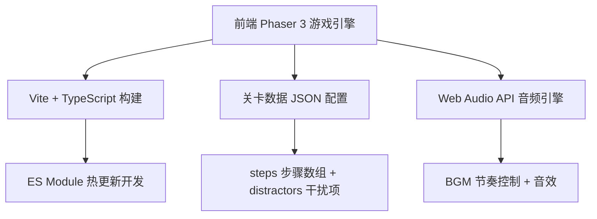

## 1. 架构设计



## 2. 技术说明

- **游戏引擎**：Phaser 3.80+ （2D 游戏框架，原生支持拖拽、动画、音频）
- **开发语言**：TypeScript 5.x
- **构建工具**：Vite 5.x + @phaserjs/vite-plugin
- **后端**：无（纯前端，数据本地 JSON 配置）
- **数据库**：无（localStorage 保存最佳成绩）
- **音频**：Phaser 内置 Web Audio API，支持播放速率调节实现 BGM 加速

## 3. 路由定义

本游戏为单页应用，使用 Phaser Scene 管理代替路由：

| 场景 (Scene) | 用途 |
|--------------|------|
| BootScene | 资源预加载、初始化 |
| MenuScene | 主菜单，关卡选择 |
| GameScene | 核心游戏玩法 |
| ResultScene | 关末统计与排名展示 |

## 4. 数据模型

### 4.1 关卡数据结构

```typescript
interface Step {
  id: string
  name: string
  icon: string
  type: 'cup' | 'ice' | 'base' | 'topping' | 'milk' | 'syrup' | 'cream'
}

interface Drink {
  name: string
  modifier: string
  steps: Step[]
  distractors: Step[]
}

interface LevelConfig {
  id: string
  brand: string
  brandColor: string
  timeLimit: number
  orderCount: number
  drinks: Drink[]
  allItems: Step[]
  rankingBrands: RankingBrand[]
}

interface RankingBrand {
  name: string
  avgSeconds: number
  color: string
}
```

### 4.2 游戏状态

```typescript
interface GameState {
  currentOrderIndex: number
  completedSteps: Step[]
  qualityScore: number
  consecutiveErrors: number
  startTime: number
  orderStartTime: number
  orderTimes: number[]
  stepErrors: Record<string, number>
  isRedoingCurrentOrder: boolean
  timeRemaining: number
}
```

## 5. 核心系统架构

### 5.1 传送带系统 (ConveyorSystem)

- 从右向左匀速移动散件 GameObject
- 散件包含正确步骤项 + 随机干扰项
- 散件移出左边界后回收重用
- 定期从当前饮品步骤池 + 干扰项池中生成新散件

### 5.2 拖拽系统 (DragSystem)

- 基于 Phaser GameObject.setDraggable / setInteractive
- 拖入出品区判定：overlap 检测
- 正确步骤：吸附入位，播放正确音效
- 错误步骤：弹回原位 + 品质分扣减 + 抖动动画

### 5.3 订单 Ticker 系统 (TickerSystem)

- 顶部横向滚动条
- 当前单居中高亮（黄底大字）
- 已完成单灰化缩小
- 切换订单时滑动过渡动画

### 5.4 品质与重做系统 (QualitySystem)

- 初始品质分 100，错误步骤 -10 分
- 连续错误计数器，达到 3 时触发重做
- 重做：清空当前出品区步骤，品质分恢复重做前值
- 重做期间计时继续

### 5.5 音频系统 (AudioSystem)

- BGM 正常速率 1.0x
- 时间 < 25 秒时 BGM 播放速率渐变至 1.5x
- 音效：正确入位、错误抖动、订单完成、关卡完成
- 静音按钮全局控制

### 5.6 统计系统 (StatsSystem)

- 记录每单组装耗时
- 记录每步骤错误次数
- 关末计算平均组装秒数
- 关末生成最易错步骤 Top 3 排行
- 六品牌模拟排名（预设基准数据 + 玩家成绩插入排序）

## 6. 文件结构

```
src/
├── main.ts                  # 入口，Phaser Game 配置
├── scenes/
│   ├── BootScene.ts         # 资源预加载
│   ├── MenuScene.ts         # 主菜单
│   ├── GameScene.ts         # 核心游戏
│   └── ResultScene.ts       # 关末统计
├── systems/
│   ├── ConveyorSystem.ts    # 传送带
│   ├── DragSystem.ts        # 拖拽判定
│   ├── TickerSystem.ts      # 订单滚动
│   ├── QualitySystem.ts     # 品质与重做
│   ├── AudioSystem.ts       # 音频控制
│   └── StatsSystem.ts       # 统计
├── data/
│   ├── level-starbucks.json # 星巴克关卡
│   ├── level-heytea.json    # 喜茶关卡
│   └── level-mixue.json     # 蜜雪关卡
├── types/
│   └── index.ts             # 类型定义
└── config/
    └── gameConfig.ts        # Phaser 游戏配置
```
